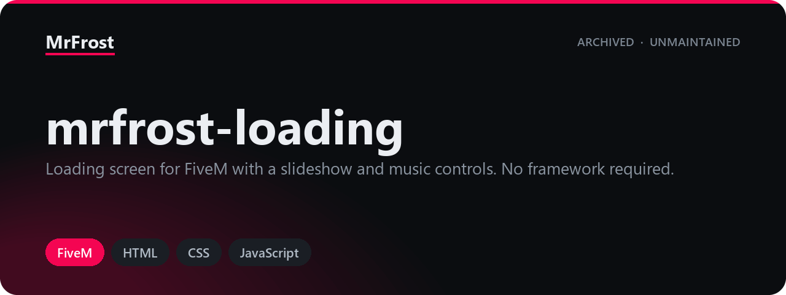

  

# mrfrost-loading

  
  
  
  
  
  
  
  

A standalone FiveM loading screen: a full-screen cross-fading slideshow, a
progress bar driven by the game's own load events, background music with
play/pause/mute/skip controls, a collapsible Discord widget and an info panel,
and the connecting player's name handed over from the server.

*Published as-is and no longer actively maintained — issues and PRs may not get a response.*

## Background

These scripts were written for a private GTA V roleplay server and ran there in
production. They are published here so the work stays available rather than
sitting on a disk, and so anyone who finds them useful can build on them.

Because they were built for one specific server rather than for general release,
they may need adapting before they drop cleanly into another
setup. This one is standalone and pulls in no other resources.

## Requirements

- A FiveM server on `fx_version "cerulean"` or newer. The manifest sets
  `lua54 "yes"`.
- **No framework.** The resource is standalone: there is no ESX, QBCore, ox_lib
  or inventory call anywhere in it. The only server-side code is a
  `playerConnecting` handler in `server.lua`.
- **A resource that dismisses the loading screen.** `fxmanifest.lua` sets
  `loadscreen_manual_shutdown "yes"`, and this resource contains no client
  script, so it never dismisses itself. Something else on the client — a spawn
  manager, a character selector or your own script — has to call
  `ShutdownLoadingScreen()` and `ShutdownLoadingScreenNui()`. Without one the
  player is left on this page after the session is ready.
- **Media files that are not in this repository.** Eleven screenshots and two
  music tracks are referenced by the page but not shipped; see
  [Assets](#assets).
- Clients need outbound HTTPS for the Google Fonts stylesheets and the Discord
  widget iframe. Both fail soft: without them the page still works, but the
  music control buttons render as words instead of icons and the Discord panel
  is empty.

## Installation

1. Copy the `mrfrost-loading` folder into your server's `resources/` directory.
2. Add `ensure mrfrost-loading` to your `server.cfg`.
3. Supply the missing media files listed under [Assets](#assets). The resource
   loads without them, but the slideshow will be blank and no music will play.
4. Make sure this is the only started resource that declares a `loadscreen`.
   Only one loading screen can be active at a time.
5. Confirm that something on your server shuts the loading screen down (see
   Requirements). If nothing does, players will never get past it.

## Assets

Thirteen files that the page references are deliberately not published, because
the rights to them are unclear. Nothing in the code was changed to remove the
references — you supply the files under the exact names below and everything
works. Both directories have to be created; they do not exist in the
repository.

| Path | Count | Referenced from |
|------|-------|-----------------|
| `assets/img/loading/loading1.jpg` … `assets/img/loading/loading11.jpg` | 11 | `index.html` lines 50-60, one `` per file |
| `assets/audio/noncopyright.mp3` | 1 | `index.html` line 39 and `assets/js/main.js` line 70 |
| `assets/audio/noncopyright1.mp3` | 1 | `assets/js/main.js` line 70 |

The screenshots are stretched to fill the screen with `object-fit: cover`, so
1920x1080 or wider works best. Both the image list and the audio list can be
shortened or extended — see [docs/assets.md](docs/assets.md) for how, and for
what happens if you leave the files out.

`assets/img/logo.svg` **is** shipped, but it is only a placeholder: a plain
black-background graphic. Replace it with your own logo at the same path, or
point the `` on line 81 of `index.html` somewhere else.

## Configuration

There is no config file. Everything is edited directly in `index.html`,
`assets/css/style.css` and `assets/js/main.js`. The values you are most likely
to want to change:

| What | Where | Default |
|------|-------|---------|
| Server name shown on the panel | `index.html:82` | `MrFrost` |
| Tagline under the name | `index.html:83` | `Your server tagline goes here` |
| Discord guild id in the widget URL | `index.html:71` | `1048024138083745812` |
| Info panel text | `index.html:90` | `Hier findest du bald mehr!` |
| Music playlist | `main.js:70` | two `.mp3` paths |
| Music volume | `main.js:79` | `0.025` (2.5%) |
| Seconds per slide | `main.js:39` | `7000` ms |
| Accent colour | `style.css:161`, `238` | `#904BDE` |

The full list, including every hardcoded string and every colour, is in
[docs/configuration.md](docs/configuration.md).

## Documentation

| Page | Contents |
|------|----------|
| [docs/configuration.md](docs/configuration.md) | Every editable value: what it is, where it lives, what it does |
| [docs/assets.md](docs/assets.md) | The media files you have to supply, and how to change the lists |
| [docs/known-issues.md](docs/known-issues.md) | What turned up while reading the code, and what a fix would look like |

## Licence

[GPL-3.0](LICENSE)
